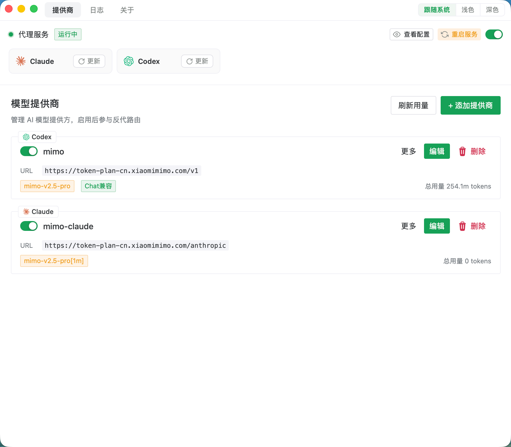
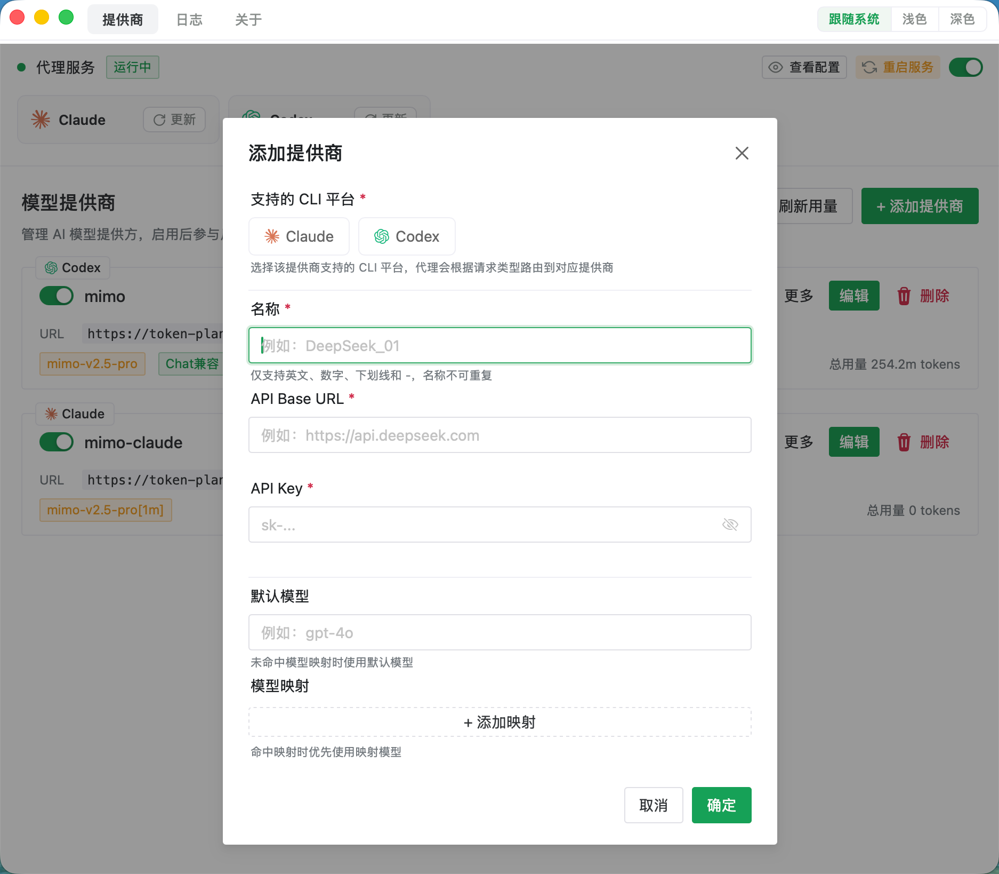

# RelayAI

将多厂商 AI 模型订阅转换为 Claude / Codex 可用接口。基于 [Wails v3](https://wails.io/docs/next/guides/installation) 构建的桌面应用，支持 macOS、Windows、Linux。

## 界面预览

|                  主界面                   |                  添加提供商                  |
| :-----------------------------------------------: | :--------------------------------------------: |
|  |  |

## 使用方式

1. 添加提供商：填写名称、Base URL、API Key，选择 CLI 平台
2. 点击「写入配置」将代理地址写入 `~/.claude/settings.json` 或 `~/.codex/config.toml`
3. 启动代理服务
4. 直接使用 Claude CLI 或 Codex CLI，请求会自动通过代理转发

代理会根据请求路径自动路由：

| 路径 | CLI | 说明 |
|------|-----|------|
| `/anthropic/*` | Claude | 直接透传 Anthropic 格式 |
| `/openai/*` | Codex | Responses API ↔ Chat Completions（开启兼容模式时） |
| `/health` | — | 健康检查 |

## 安装

### 下载预编译版本

从 [Releases](../../releases) 页面下载对应平台的安装包。

### macOS 安装提示

macOS 未签名的应用首次打开时可能提示 **"RelayAI" 已损坏**，这是 Gatekeeper 安全机制，并非文件损坏。解决方法：

```bash
sudo xattr -r -d com.apple.quarantine /Applications/RelayAI.app
```

或在 Finder 中右键 → 「打开」→ 确认「打开」。

### 运行

```bash
# macOS
open RelayAI.app

# Windows
RelayAI.exe

# Linux
./RelayAI
```

## 构建

### 前置依赖

- Go 1.26+
- Node.js 18+
- [Wails v3](https://wails.io/docs/next/guides/installation)

```bash
go install tool
make install
```

### 使用 Make（推荐）

```bash
make build                # 构建当前平台
make run                  # 构建并运行
make build-darwin         # macOS .app
make build-windows        # Windows .exe
make build-linux          # Linux

# 指定架构
make build-darwin-arm64
make build-darwin-amd64
make build-darwin-universal

# 其他
make test                 # 运行测试
make fmt                  # 格式化 + 代码检查
make clean                # 清理构建产物
make info                 # 显示版本信息
```

### 使用 Wails3

```bash
wails3 task darwin:package              # macOS 当前架构
wails3 task darwin:package ARCH=arm64   # Apple Silicon
wails3 task darwin:package:universal    # Universal
wails3 task windows:build ARCH=amd64    # Windows
wails3 task linux:build ARCH=amd64      # Linux
```

> 跨平台构建需先准备 Docker 镜像：`make setup-docker`

## 开发

```bash
make dev                  # 启动开发模式（热更新）
make dev-frontend         # 仅启动前端开发服务器
```

## 数据存储

SQLite 数据库：`~/.relayai/relayai.db`

## 许可证

MIT
